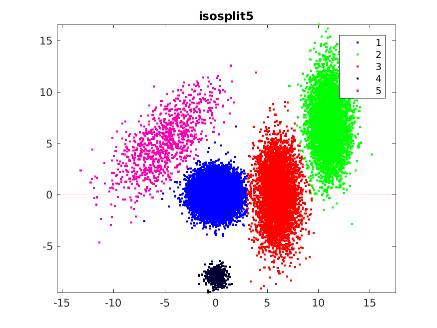

# ISO-SPLIT

ISO-SPLIT is an efficient clustering algorithm that
handles an unknown number of unimodal clusters in low to moderate dimension,
without any user-adjustable parameters.
It is based on repeated tests for unimodality---using isotonic regression and a modified Hartigan dip test---applied to 1D projections of pairs of putative clusters.
It handles well non-Gaussian clusters of widely
varying densities and populations,
and in such settings has been shown to outperform K-means variants, Gaussian
mixture models, and density-based methods.

This repository contains an efficient single-threaded
implementation in C++, with a MATLAB/MEX interface.

It was invented and coded by Jeremy Magland, with contributions to the algorithm and tests by Alex Barnett, at SCDA/Flatiron Institute.

(C) Jeremy Magland 2015-2018.




### Dependencies and compilation

For now, C++ and MATLAB codes are together, and [MATLAB](http://www.mathworks.com/products/matlab) is a dependency.

In MATLAB, from the repository's root directory, do:

```
cd matlab
compile_mex_isosplit5
cd ..
run_test
```

You should get a plot showing three correctly-clustered point clouds.

### Usage

Here is a simple equal-population isotropic
Gaussian demo with 100000 points in MATLAB. Make sure that the `matlab`
directory is in your MATLAB path:
```
d = 20;                                              % number of dimensions
n = 1e4;                                             % points per cluster
K = 10;                                              % number of clusters
rng(1);                                              % fix the seed
X = randn(d,K*n) + 2.0*kron(randn(d,K),ones(1,n));   % N=K*n points in d dims
L = isosplit5_mex(X);                                % cluster: takes 1.6 sec
k = mode(reshape(L,[n,K]),1);                        % get gross labeling
fprintf('gross label errors: %d\n',sum(sort(k)-(1:K)))
fprintf('number of points misclassified: %d\n',sum(L~=kron(k,ones(1,n))))
```

The outputs should be `0` and `14`.
The reader (once they have parsed the last three lines of code above) should
conclude that the number of clusters was correctly found, and that
14 out of 100000 points were misclassified.

### Further usage and tests

This repo also contains a hybrid MATLAB/C++ implementation,
which uses C++/MEX for the isocut (and jisotonic) stages.
For this, do `compile_mex_isocut5`.
Then, running `isosplit5` with no arguments does a simple
2D self-test of both the hybrid and the pure C++ versions, and produces
the above picture.

### References

"Unimodal clustering using isotonic regression: ISO-SPLIT," J. F. Magland and A. H. Barnett. technical report (2016). stat.ME/1508.04841v2

"A fully automated approach to spike sorting," J. E. Chung, J. F. Magland, A. H. Barnett, V. M. Tolosa, A. C. Tooker, K. Y. L ee, K. G. Shah, S. H. Felix, L. M. Frank, L. F. Greengard.
NEURON 95(6) 1381–1394 (2017)


### To do

* calling from C++ demo
* separate the src and matlab directories
* openmp
* python wrapper
* more impressive pic/demos
